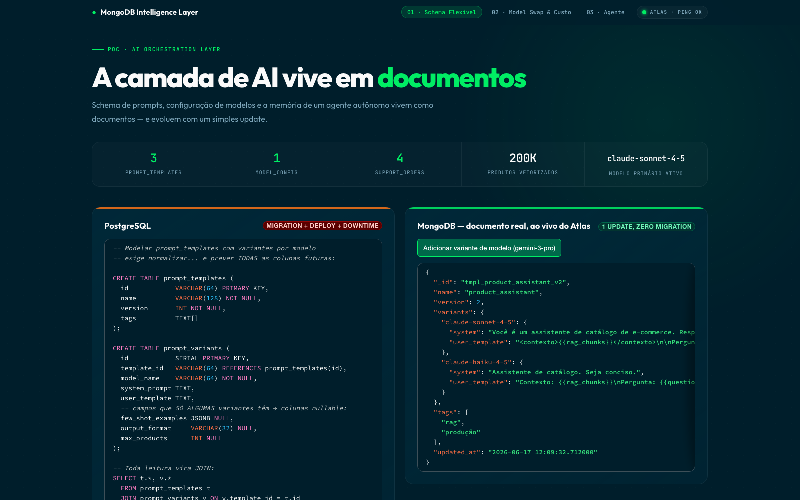
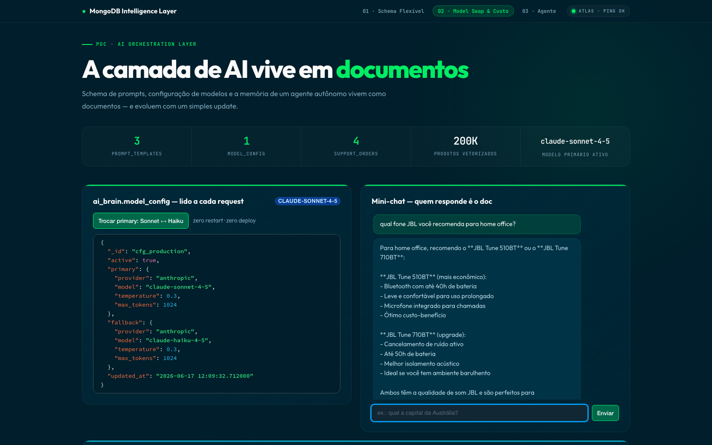
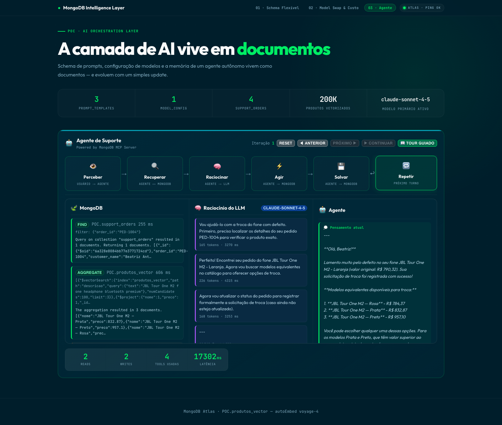
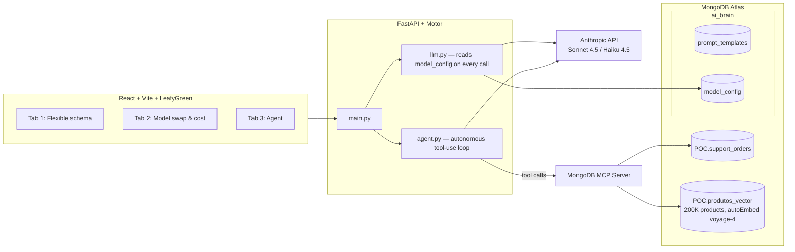

# MongoDB Intelligence Layer — POC

A proof of concept showing MongoDB as the data and orchestration layer for AI
applications. Prompt schemas, model configuration, and an autonomous agent's
memory all live as documents — and evolve with a single `update_one`, not a
migration or a redeploy.

**Stack:** React + Vite + LeafyGreen UI · FastAPI + Motor (async) · MongoDB Atlas (Vector Search with autoEmbed voyage-4) · **MongoDB MCP Server** · Anthropic API (Sonnet 4.5 / Haiku 4.5)

> The demo UI is in Portuguese, since it is used in client-facing sessions with Brazilian teams.

## The demo in action

### Tab 1 — Flexible schema
Prompt templates with per-model variants are polymorphic documents: adding a variant for a new model is a live `$set` against Atlas, and the JSON updates on screen in real time.



### Tab 2 — Model swap & cost
The production model is a document (`model_config`), read on every request. Switching Sonnet ↔ Haiku is an `update_one` — zero restarts, zero deploys. A cost panel projects the monthly spend per model from the real token counts of the session.



### Tab 3 — The agent (Powered by MongoDB MCP Server)
An autonomous support agent runs a **real tool-use loop**: Claude decides which MongoDB tools to call — `find` an order, `$vectorSearch` the catalog for replacements, `update` a status — and they are executed against Atlas through the **MongoDB MCP Server**. The run is recorded and replayed step by step across the `Perceive → Retrieve → Reason → Act → Store → Loop` phases, with real read/write/latency counters. This single tab tells the whole "MongoDB as the agent's data layer" story (retrieval, memory, and writes), so it absorbs what used to be separate memory and RAG tabs.



## Architecture



The agent reasons with Claude and acts on MongoDB **through the MCP Server** —
the same protocol an IDE or any MCP client would use, so the integration is the
real thing, not a simulation.

## Getting started

**Prerequisites:** Python 3.12+, Node.js 20+ (the backend launches the MongoDB MCP Server via `npx`).

1. **Credentials** (never commit the real `.env`):

   ```bash
   cp .env.example .env
   # fill in MONGODB_URI and ANTHROPIC_API_KEY
   ```

2. **Backend**:

   ```bash
   cd backend
   python3 -m venv .venv && source .venv/bin/activate
   pip install -r requirements.txt
   python seed.py            # seeds ai_brain + POC.support_orders, prints the counts
   uvicorn main:app --reload --port 8000
   ```

   On startup the backend opens a long-lived MongoDB MCP Server session (over stdio) and reuses it for every agent run.

3. **Frontend**:

   ```bash
   cd frontend
   npm install
   npm run dev               # http://localhost:5173
   ```

The included `start.sh` boots both processes at once (FastAPI on :8000, Vite on :5173).

## Docker

```bash
docker build -t intelligence-layer-poc .
docker run --env-file .env -p 8080:8080 intelligence-layer-poc
# → http://localhost:8080 (nginx serves the frontend and proxies /api to FastAPI)
```

## Visual regression tests

With the app running (`./start.sh`):

```bash
npm install
npm run test:visual           # compares the three tabs against the baselines in tests/visual/
npm run test:visual:update    # regenerates the baselines after an intentional UI change
```

Dynamic regions (collection counts, live Atlas documents, agent traces) are masked, so the tests guard layout rather than data.
