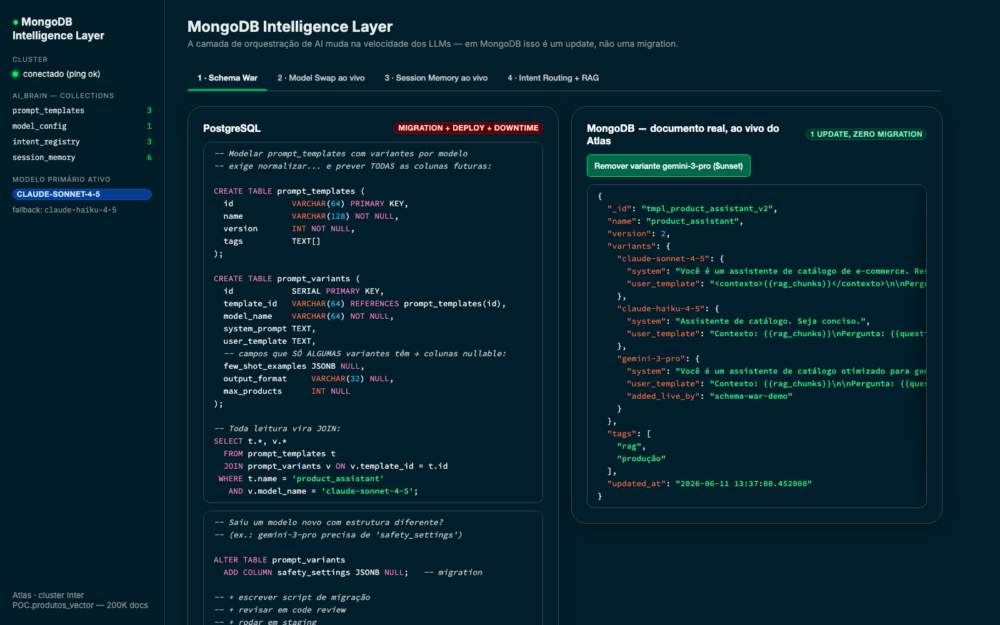
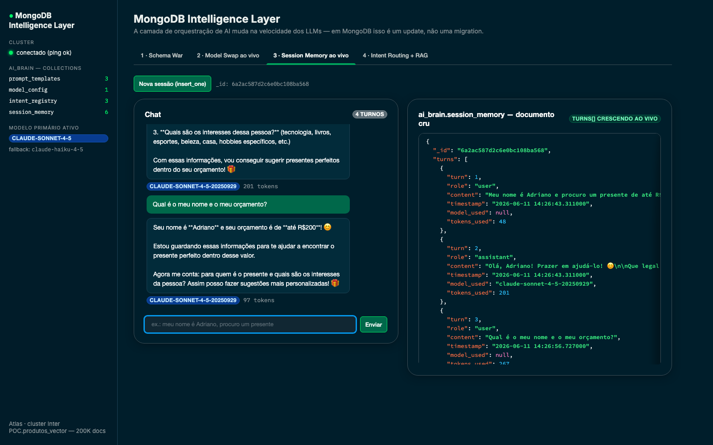
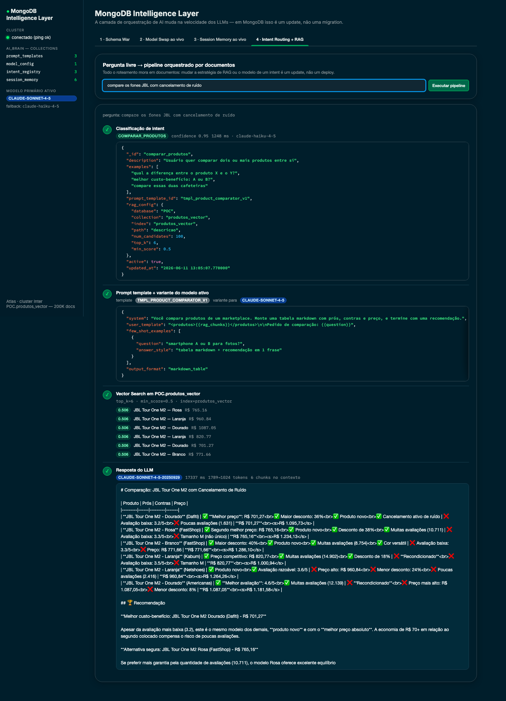
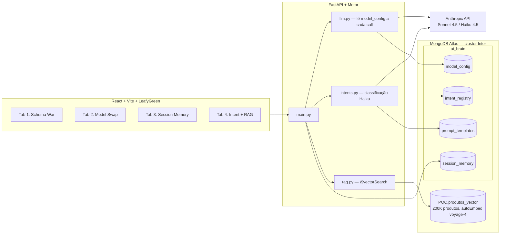

# MongoDB Intelligence Layer — POC

Demonstração de por que MongoDB é a camada ideal de orquestração para aplicações
de AI: prompts, memória de sessão, roteamento de intents e configuração de
modelos mudam na velocidade dos lançamentos de LLMs — e em MongoDB isso é um
`update_one`, não uma migration.

**Stack:** React + Vite + LeafyGreen UI · FastAPI + Motor (async) · MongoDB Atlas (Vector Search com autoEmbed voyage-4) · Anthropic API (Sonnet 4.5 / Haiku 4.5)

## A demo em ação

### Tab 1 — Schema War
O mesmo concern nos dois mundos: em PostgreSQL, variantes de prompt por modelo exigem normalização, JOINs e migrations; em MongoDB, é um `$set` ao vivo no documento.



### Tab 2 — Model Swap ao vivo
O modelo de produção é um documento (`model_config`), lido a cada request. Trocar Sonnet ↔ Haiku é um `update_one` — zero restart, zero deploy.


### Tab 3 — Session Memory ao vivo
Chat à esquerda, documento cru da sessão à direita — cada turno é um `$push` no array `turns[]`, com `model_used` e `tokens_used`. Sem JOIN, sem Redis na frente.



### Tab 4 — Intent Routing + RAG
Pipeline completo orquestrado por documentos: Haiku classifica o intent (~1s), o intent aponta para template + rag_config, o `$vectorSearch` roda sobre 200K produtos com autoEmbed voyage-4, e o Sonnet gera a resposta final com os chunks no contexto.



## Arquitetura



## Setup

1. **Credenciais** (nunca commitar o `.env` real):

   ```bash
   cp .env.example .env
   # preencha MONGODB_URI e ANTHROPIC_API_KEY
   ```

2. **Backend**:

   ```bash
   cd backend
   python3 -m venv .venv && source .venv/bin/activate
   pip install -r requirements.txt
   python seed.py            # popula ai_brain e imprime os counts
   uvicorn main:app --reload --port 8000
   ```

3. **Frontend**:

   ```bash
   cd frontend
   npm install
   npm run dev               # http://localhost:5173
   ```

## Roteiro de demo — 10 minutos (talk track SA → CTO)

> Contexto de abertura (30s): *"Toda aplicação de AI tem duas camadas: os dados
> de negócio e a camada de orquestração — prompts, memória, roteamento,
> configuração de modelos. A segunda muda na velocidade dos lançamentos de LLM:
> a cada 2–3 meses sai um modelo novo com formato de prompt diferente. A
> pergunta que importa: quando isso acontecer, seu time roda uma migration ou
> edita um documento?"*

### Tab 1 — Schema War (2 min)

- Mostre o lado PostgreSQL: *"Para modelar templates de prompt com variantes
  por modelo em relacional, eu preciso normalizar — tabela de templates, tabela
  de variantes, colunas nullable para os campos que só algumas variantes têm, e
  JOIN em toda leitura."*
- Aponte o `ALTER TABLE`: *"Saiu o modelo novo do Google com um campo que não
  existia? Migration, code review, staging, janela de deploy."*
- Clique em **Adicionar variante de modelo**: *"No MongoDB, é isto. Um `$set`.
  O documento que vocês estão vendo veio agora do Atlas — repara no JSON
  atualizando na tela. Zero migration, zero downtime."*
- Feche na tabela de concerns: *"Cada linha dessa tabela é uma semana de
  backlog em relacional e um update em MongoDB."*

### Tab 2 — Model Swap ao vivo (2,5 min)

- Mostre o `model_config`: *"O modelo que a aplicação usa é um documento. O
  backend lê esse documento a cada request — sem cache, de propósito."*
- Faça uma pergunta no mini-chat → badge **claude-sonnet-4-5**, anote a latência.
- Clique em **Trocar primary** e refaça a MESMA pergunta → badge
  **claude-haiku-4-5**, latência ~3x menor: *"Eu acabei de trocar o modelo de
  produção da aplicação com um `update_one`. Nenhum restart, nenhum deploy,
  nenhuma variável de ambiente. Pensem em troca de provider, rollback de modelo
  problemático, canary de modelo novo — tudo vira operação de dado, não de
  infra."*
- Bônus: o documento também carrega o `fallback` — resiliência a indisponibilidade
  de API declarada em dado.

### Tab 3 — Session Memory ao vivo (2,5 min)

- Layout split: *"Chat à esquerda; à direita, o documento cru da sessão no
  Atlas, atualizando a cada turno."*
- Mande: *"Meu nome é X e procuro um presente de até R$200"* → aponte o array
  `turns[]` crescendo com `model_used` e `tokens_used` por turno.
- Pergunte: *"Qual é o meu nome e o orçamento?"* → o modelo responde da memória:
  *"A memória conversacional é nativa: um array dentro do documento da sessão.
  Em relacional isso é uma tabela de turns com JOIN por sessão — e na prática
  os times acabam adicionando um Redis na frente. Aqui não há cache layer
  separado: o documento É a sessão."*
- Clique em **Nova sessão**: cada sessão é um documento independente, com TTL
  index opcional para expiração automática.

### Tab 4 — Intent Routing + RAG (2,5 min)

- Digite uma pergunta livre (ex.: *"compare os fones JBL com cancelamento de
  ruído"*) e deixe o pipeline rodar passo a passo:
  1. *"O Haiku classifica o intent em ~1s — e a lista de intents possíveis veio
     do `intent_registry`, não do código."*
  2. *"O intent aponta para um template, e o template tem a variante do modelo
     ativo — os dois são documentos."*
  3. *"O Vector Search roda na collection de 200K produtos com autoEmbed
     voyage-4 — o texto da pergunta vai cru na query e o Atlas embeda na hora.
     Busca vetorial e dados operacionais no mesmo banco, sem pipeline de
     sincronização para um vector DB separado."*
  4. *"A resposta final usa o prompt da variante + os chunks — com badge de
     modelo, latência e tokens."*
- Fechamento: *"Mudar o top_k, o min_score, o template ou o modelo de um intent
  é um update em um documento. A estratégia de AI de vocês passa a evoluir na
  velocidade do negócio, não na velocidade do ciclo de deploy."*

### Perguntas frequentes (anexo do SA)

| Pergunta do cliente | Resposta curta |
| --- | --- |
| "PostgreSQL tem JSONB, não resolve?" | JSONB guarda o documento, mas sem Atlas Search/Vector Search nativos, sem `$push` atômico idiomático em arrays profundos, e o ecossistema (índices parciais em campos dinâmicos, sharding por sessão) volta a exigir modelagem relacional ao redor. |
| "E governança/schema?" | Schema validation (JSON Schema) por collection — flexível onde precisa, rígido onde importa. |
| "E o vector DB dedicado?" | Atlas Vector Search elimina a sincronização dual-write; os 200K produtos desta demo são a prova — uma collection, um índice, autoEmbed. |
