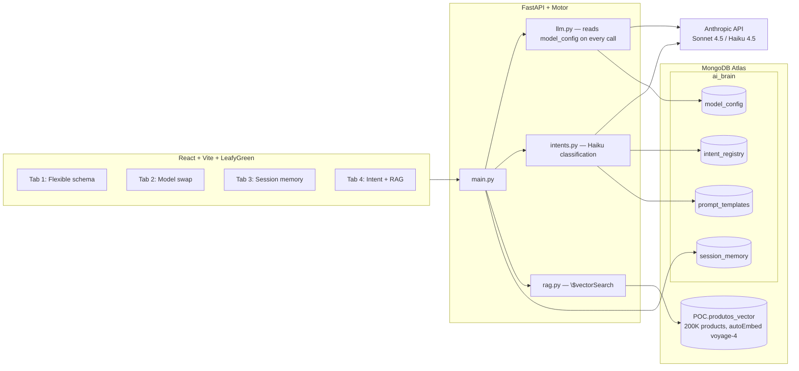

# MongoDB Intelligence Layer — POC

A proof of concept showing MongoDB as the orchestration layer for AI applications.
Prompts, session memory, intent routing, and model configuration all live as
documents — and evolve with a single `update_one`, not a migration or a redeploy.

**Stack:** React + Vite + LeafyGreen UI · FastAPI + Motor (async) · MongoDB Atlas (Vector Search with autoEmbed voyage-4) · Anthropic API (Sonnet 4.5 / Haiku 4.5)

> The demo UI is in Portuguese, since it is used in client-facing sessions with Brazilian teams.

## The demo in action

### Tab 1 — Flexible schema
Prompt templates with per-model variants are polymorphic documents: adding a variant for a new model is a live `$set` against Atlas, and the JSON updates on screen in real time.


### Tab 2 — Live model swap
The production model is a document (`model_config`), read on every request. Switching Sonnet ↔ Haiku is an `update_one` — zero restarts, zero deploys. A cost panel projects the monthly spend per model from the real token counts of the session.


### Tab 3 — Live session memory
Chat on the left, the raw session document on the right — each turn is a `$push` onto the `turns[]` array, carrying `model_used` and `tokens_used`. The document *is* the session.


### Tab 4 — Intent routing + RAG
A full pipeline orchestrated by documents: Haiku classifies the intent (~1s), the intent points to a template and a `rag_config`, `$vectorSearch` runs over 200K products with autoEmbed voyage-4, and Sonnet produces the final answer from the retrieved chunks. A retrieval funnel and a cost panel show how candidate narrowing maps to context tokens and dollars at scale.


## Architecture



## Getting started

1. **Credentials** (never commit the real `.env`):

   ```bash
   cp .env.example .env
   # fill in MONGODB_URI and ANTHROPIC_API_KEY
   ```

2. **Backend**:

   ```bash
   cd backend
   python3 -m venv .venv && source .venv/bin/activate
   pip install -r requirements.txt
   python seed.py            # seeds ai_brain and prints the collection counts
   uvicorn main:app --reload --port 8000
   ```

3. **Frontend**:

   ```bash
   cd frontend
   npm install
   npm run dev               # http://localhost:5173
   ```

The included `start.sh` boots both processes at once (FastAPI on :8000, Vite on :5173).

## Docker

```bash
docker build -t intelligence-layer-poc .
docker run --env-file .env -p 8080:8080 intelligence-layer-poc
# → http://localhost:8080 (nginx serves the frontend and proxies /api to FastAPI)
```

## Visual regression tests

With the app running (`./start.sh`):

```bash
npm install
npm run test:visual           # compares the four tabs against the baselines in tests/visual/
npm run test:visual:update    # regenerates the baselines after an intentional UI change
```

Dynamic regions (collection counts, live Atlas documents, chat history) are masked, so the tests guard layout rather than data.
