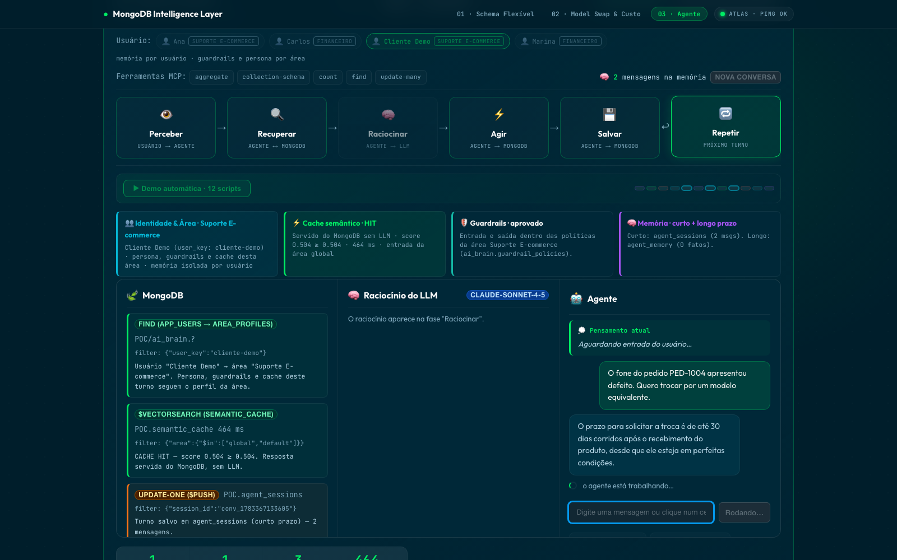
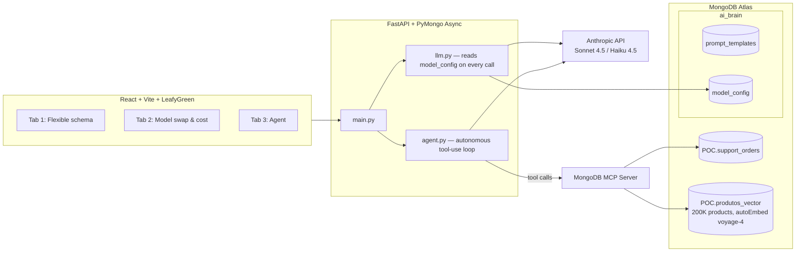

# MongoDB Intelligence Layer — POC

A proof of concept showing MongoDB as the data and orchestration layer for AI
applications. Prompt schemas, model configuration, and an autonomous agent's
memory all live as documents — and evolve with a single `update_one`, not a
migration or a redeploy.

**Stack:** React + Vite + LeafyGreen UI · FastAPI + **PyMongo Async** (the official async driver that replaced the deprecated Motor) · MongoDB Atlas (Vector Search with autoEmbed voyage-4) · **MongoDB MCP Server** · Anthropic API (Sonnet 4.5 / Haiku 4.5)

> The demo UI is in Portuguese, since it is used in client-facing sessions with Brazilian teams.

## The demo in action

### Tab 1 — Flexible schema
Prompt templates with per-model variants are polymorphic documents: adding a variant for a new model is a live `$set` against Atlas, and the JSON updates on screen in real time.


### Tab 2 — Model swap & cost
The production model is a document (`model_config`), read on every request. Switching Sonnet ↔ Haiku is an `update_one` — zero restarts, zero deploys. A cost panel projects the monthly spend per model from the real token counts of the session.


### Tab 3 — The agent (Powered by MongoDB MCP Server)
An autonomous support agent runs a **real tool-use loop**: the model decides which MongoDB tools to call — `find` an order, `$vectorSearch` the catalog for replacements, `update` a status — and they are executed against Atlas through the **MongoDB MCP Server** (the available tools are shown in a panel, lit up as they are used). The run is recorded and replayed step by step across the `Perceive → Retrieve → Reason → Act → Store → Loop` phases, with real read/write/latency counters.

**Session memory lives in a document — hybrid pattern.** Every turn is `$push`-ed to `POC.agent_sessions` (capped with `$slice`, so the array never grows unbounded). Each run then *hydrates the last few turns* from that document into the model's context — implicit references ("e o outro pedido?") just work — while the **full** history remains a query: asking the agent to *"consolidate all the questions I've asked"* still triggers a real `find` on `agent_sessions`, making the persistence visible as a MongoDB operation. Recent window in context + query for everything older is the production-standard shape for short-term agent memory. This single tab tells the whole "MongoDB as the agent's data layer" story (retrieval, memory, and writes), so it absorbs what used to be separate memory and RAG tabs.


### The intelligence pipeline (inside the agent tab)

Every agent turn now runs through a pipeline where **each step is a real MongoDB operation**, surfaced live in the trace and in three "feature flag" cards plus a MongoDB inspector:

```
mensagem → [Guardrail entrada + máscara de PII] → [Cache semântico?] ──HIT──→ resposta (sem LLM) ⚡
                                        │ MISS
                                        ▼
                (em paralelo: extração de fatos p/ memória LP — Haiku)
                                        ▼
        [memória LP relevante + últimos turnos CP] → loop do agente (MCP)
                                        ▼
                          [Guardrail saída] → salva CP + LP → grava no cache
```

**Semantic cache** — before calling the model, the question is `$vectorSearch`-ed against `POC.semantic_cache` (autoEmbed voyage-4). If a semantically-equivalent question was already answered (score ≥ threshold), the stored answer is served **straight from MongoDB with no LLM call**, and the UI raises a green **CACHE HIT** flag with the similarity score and latency. A `$inc` on `hits` makes reuse visible. The HIT threshold is itself **live config** (`ai_brain.cache_config`), calibrated by measurement (`backend/calibrate_thresholds.py`) — recalibrating is an `update_one`, not a deploy.



Two cache-hygiene rules keep the shared cache safe:
- **Only generic turns are cached.** Turns that touched a specific order (any business tool call) or that involved the customer personally — facts extracted from the message, or long-term memory injected into the prompt (the answer may say "Olá, Dri!") — are **never** written to the cache. Personalized answers must not be replayed to another user.
- **Freshness is the database's job.** Runtime entries carry an `expires_at` date and a **MongoDB TTL index** deletes them automatically after 24h — no cron, no invalidation code. Seeded FAQs have no `expires_at`, so they never expire.

**Multi-user & multi-area (per-department isolation).** The tab has a user
switcher backed by `POC.app_users`: each user has a `user_key` (which scopes
their short- and long-term memory — one user never sees another's facts) and
belongs to an **area** (department). The area — via `ai_brain.area_profiles`
and per-area documents in `guardrail_policies` — decides three isolations per
turn, all of them document reads:

1. **Persona / business rules** → `area_profiles.persona` is appended to the
   agent's system prompt (e.g. Financeiro: "never negotiate outside the official
   system, never give investment advice"). Editing an area's rules is an
   `update_one`, zero deploy.
2. **Guardrails** → one active policy document per area (fallback `default`).
   Financeiro has a stricter denylist threshold, extra banned terms and its own
   block message; denylist entries may carry an `area` field to apply to a single
   area, otherwise they're global.
3. **Semantic cache** → runtime entries are tagged with the area that produced
   them and only serve users of the same area (seeded FAQs are `area: "global"`).

All three vector searches (cache, denylist, memory) use **native pre-filtering**:
`area` / `user_key` / `active` are `filter`-type fields in the vector indexes, so
the ANN search only traverses applicable vectors — the top-K results are always
valid for the requesting tenant, no matter how large the collections grow (this
is the correct multi-tenant pattern, vs. app-side post-filtering which silently
loses recall at scale). If an index doesn't have the filter field yet, the code
degrades to post-filtering, then to exact match.

Try it: send *"Consegue me dar um desconto na fatura por fora?"* as **Marina
(Financeiro)** → blocked by the area's policy; switch to **Cliente Demo
(Suporte)** → same message passes and is answered normally. In production the
`user_key`/area would come from real auth (JWT/OIDC), never from the client
payload — the switcher stands in for a login.

**Two-tier memory, both in MongoDB:**
- **Short-term** → `POC.agent_sessions` — the `turns[]` of the current conversation (`$slice`-capped; recent turns hydrated into context, full history queried on demand). "Nova conversa" resets it.
- **Long-term** → `POC.agent_memory` — durable facts about the *user*, **one document per fact** (`{user_key, fact, category, active, superseded_by}`), consolidated across conversations. Starting a new conversation wipes short-term but **not** long-term. Facts are extracted by a cheap Haiku pass that runs **concurrently with the agent loop** (the customer never waits for memory consolidation); four properties make this production-shaped:
  - **Memory is a query.** When a user has more facts than fit comfortably in the prompt, loading memory becomes a `$vectorSearch` over the facts (autoEmbed index `agent_memory_vs`) **pre-filtered natively** by `user_key` + `active` — only the facts relevant to *this* question are injected, so tokens don't grow with memory size.
  - **Supersession, not contradiction.** A new fact that contradicts an old one ("prefiro e-mail" after "prefiro WhatsApp") inserts the new doc and flips the old to `active: false` + `superseded_by` **in one ACID transaction**. Nothing is deleted — the inspector shows the struck-through history as an audit trail.
  - **The agent can't edit its own memory.** The tool loop enforces a per-collection write scope (`update-many` → `POC.support_orders` only); a "creative" agent trying to rewrite `agent_memory` gets denied in-app (visible in the trace) and the platform performs the auditable supersession instead.
  - **Memory is data, never instructions.** Retrieved facts are injected inside explicit `<fatos_do_cliente>` delimiters with an instruction to ignore any command embedded in them, and the extractor refuses to store instruction-shaped "facts" — closing the *memory poisoning* vector (a user can't dictate a persistent rule into the agent's system prompt).

**Guardrails whose policy and audit layers are MongoDB** (honest framing — Mongo is the policy store, semantic matcher, and system of record, not the toxicity classifier):
- **Policy as a document** → `ai_brain.guardrail_policies` — PII regex, banned terms, and thresholds live in one editable doc; tightening a rule is an `update_one`, same live-config story as `model_config`.
- **Semantic denylist** → `POC.guardrail_denylist` — forbidden example utterances stored with embeddings; an incoming message is `$vectorSearch`-ed against them and blocked if it's *semantically* close to a forbidden intent (leak another customer's data, prompt-injection, guaranteed-return advice) even when phrased differently. Each area's policy also declares a `semantic_fail_mode`: if the semantic layer is ever unavailable, `default` fails **open** (regex still applies) while Financeiro fails **closed** — availability posture is policy, not code.
- **PII never leaves the guardrail in the clear.** Input PII (CPF, card numbers) is masked **before** the message reaches the LLM, the cache, the memory extractor, the session document, or the trace; output PII is redacted again before the answer reaches the user. `agent_sessions`, `agent_traces` and `guardrail_events` therefore only ever store the masked text — no persisted collection is itself a leak.
- **Audit log** → `POC.guardrail_events` — every check (allow / block / mask) is appended and queryable during the PoV. Auto-expires after 30 days via TTL index.
- **Observability** → `POC.agent_traces` — every agent turn's full replayable trace (phases, tool calls, latencies, cache/guardrail outcomes) is persisted as a document, queryable for debugging and compliance. Auto-expires after 30 days via TTL index.

> **Note on scores (measured, not guessed):** voyage-4 autoEmbed on this cluster compresses `vectorSearchScore` into a narrow band — measured 2026-07 with `backend/calibrate_thresholds.py`: ~0.5014 unrelated → ~0.5056 for **identical** text (identical text does *not* score 1.0 in this regime). Ranking is reliable; the absolute scale is not. That's exactly why no threshold here is hardcoded folklore: the cache threshold lives in `ai_brain.cache_config` and the denylist thresholds in `ai_brain.guardrail_policies`, both set by the calibration script against labeled probe pairs and editable live. Re-run the script whenever the embedding model, cluster, or seeded data changes.

**Collections at a glance** (all inspectable in Compass / the in-app 🔎 inspector):

| Collection | Database | Role |
|---|---|---|
| `cache_config` | ai_brain | live-editable cache threshold/TTL (calibrated, zero-deploy) |
| `semantic_cache` | POC | Q&A + autoEmbed vector (cache HIT/MISS), tagged per area |
| `agent_sessions` | POC | short-term (per-conversation) memory |
| `agent_memory` | POC | long-term (per-user) memory, keyed by `user_key` |
| `app_users` | POC | users: `user_key` + which area they belong to |
| `area_profiles` | ai_brain | per-area persona/business rules (system prompt) |
| `guardrail_policies` | ai_brain | live-editable guardrail policy, one per area |
| `guardrail_denylist` | POC | forbidden utterances + autoEmbed vector (global or per-area) |
| `guardrail_events` | POC | guardrail audit log (user + area, PII-masked) |
| `agent_traces` | POC | persisted replayable trace of every agent turn |

**Hands-free pitch.** The **▶ Demo automática** button plays a curated 12-script
playlist (`/api/agent/playlist`) that alternates the five stories — cache,
guardrail, memory, transactional agent, **and area isolation**. Each script
declares who is speaking: the demo switches the user pill live (Cliente Demo →
Marina/Financeiro → Ana → Carlos), so the audience watches the same question get
blocked in one area and answered in another, and a generic answer cached by
Suporte come back as a MISS for Financeiro. While **paused**, the ◀/▶ buttons
walk back through the steps and *across* the already-played scripts (pure replay
from an in-memory history — no API calls, results stay exactly as they happened),
so you can rewind to the cache HIT or the guardrail block mid-pitch and resume
from there.

**The agent's model follows the Model Swap tab.** The agent runs on the *active primary* model from `ai_brain.model_config`, so switching Sonnet ↔ Haiku there changes the agent's latency/cost live (≈9.5 s → ≈6 s per transactional turn on Haiku, no redeploy). Cache-HIT and guardrail-blocked turns skip the LLM entirely and stay instant. The agent loop also marks its system prompt and tool schemas with `cache_control`, so Anthropic prompt-caching speeds up every follow-up iteration.

**"What stops the agent from dropping a collection?"** Defense in depth, and the strongest layers live at the database:
1. **App-side tool allowlist** — the loop only exposes `find`, `aggregate`, `count`, `collection-schema` and a single scoped write (`update-many`); no `delete`/`drop` tool ever reaches the model.
2. **App-side write policy** — the write is scoped to `POC.support_orders` **and** its filter must target a specific `order_id`: a hallucinating (or injected) agent issuing `update-many` with an empty/broad filter is denied in-app before the MCP Server is ever touched — no mass-write is possible. Both denials are visible in the trace.
3. **Database-side (recommended for production):** run the MCP Server with a dedicated Atlas database user scoped to `readWrite` on `POC` only — then even a prompt-injected agent physically cannot touch other databases. The MCP Server also supports a read-only mode (`MDB_MCP_READ_ONLY=true`) for retrieval-only agents.
4. The MCP Server wraps all query results in a prompt-injection guard (visible in the raw tool output), and the input guardrail blocks injection attempts before the model is even called.

## Production notes (deliberate PoV shortcuts)

Three things are intentionally demo-shaped; say them out loud before an architect asks:

1. **Identity comes from the UI switcher.** In production `user_key`/area come from real auth (JWT/OIDC), never from the client payload.
2. **Orders are not tenant-scoped.** The demo lets any user look up any `PED-*` so the scripted scenarios work. In production, business-data reads get the customer's identity injected into the query filter by the app (the same pattern the memory already demonstrates with `user_key` as a native vector-index filter) — the model never decides *whose* data it can see.
3. **The reset endpoints (`DELETE /api/cache`, `DELETE /api/memory/*`) are unauthenticated demo conveniences.** Disable or protect them anywhere that isn't a controlled demo network.

## Architecture



The agent reasons with Claude and acts on MongoDB **through the MCP Server** —
the same protocol an IDE or any MCP client would use, so the integration is the
real thing, not a simulation.

## Getting started

**Prerequisites:** Python 3.12+, Node.js 20+ (the backend launches the MongoDB MCP Server via `npx`).

1. **Credentials** (never commit the real `.env`):

   ```bash
   cp .env.example .env
   # fill in MONGODB_URI and ANTHROPIC_API_KEY
   ```

2. **Backend**:

   ```bash
   cd backend
   python3 -m venv .venv && source .venv/bin/activate
   pip install -r requirements.txt
   python seed.py            # seeds ai_brain + POC (orders, cache FAQs, cache_config,
                             # guardrail policies + denylist), runs idempotent schema
                             # migrations, and creates the autoEmbed vector indexes
                             # (semantic_cache_vs, guardrail_denylist_vs, agent_memory_vs)
                             # + TTL indexes (cache, audit log, traces)
   python calibrate_thresholds.py   # optional: re-measure the score band and
                                    # suggest thresholds (--apply writes them)
   uvicorn main:app --reload --port 8000
   ```

   On startup a background **supervisor task** owns the MongoDB MCP Server session
   (over stdio): it pings it every 30s and reconnects with backoff if the process
   dies — the agent recovers on its own, no backend restart needed.

3. **Frontend**:

   ```bash
   cd frontend
   npm install
   npm run dev               # http://localhost:5173
   ```

The included `start.sh` boots both processes at once (FastAPI on :8000, Vite on :5173).

## Docker

```bash
docker build -t intelligence-layer-poc .
docker run --env-file .env -p 8080:8080 intelligence-layer-poc
# → http://localhost:8080 (nginx serves the frontend and proxies /api to FastAPI)
```

## Visual regression tests

With the app running (`./start.sh`):

```bash
npm install
npm run test:visual           # compares the three tabs against the baselines in tests/visual/
npm run test:visual:update    # regenerates the baselines after an intentional UI change
```

Dynamic regions (collection counts, live Atlas documents, agent traces) are masked, so the tests guard layout rather than data.

The tests target `http://localhost:5173` by default. **If that port is taken by another app, the tests will screenshot the wrong page and fail** — start this frontend on a free port and point the tests at it:

```bash
npx vite --port 5174                                   # in frontend/
BASE_URL=http://localhost:5174 npm run test:visual     # from the repo root
```
