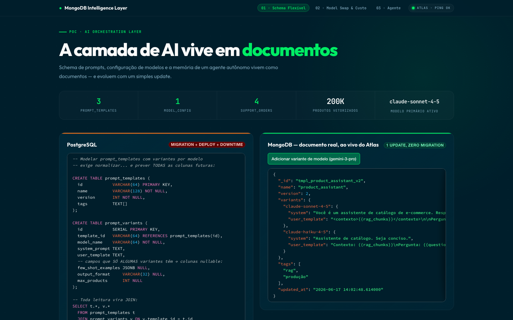
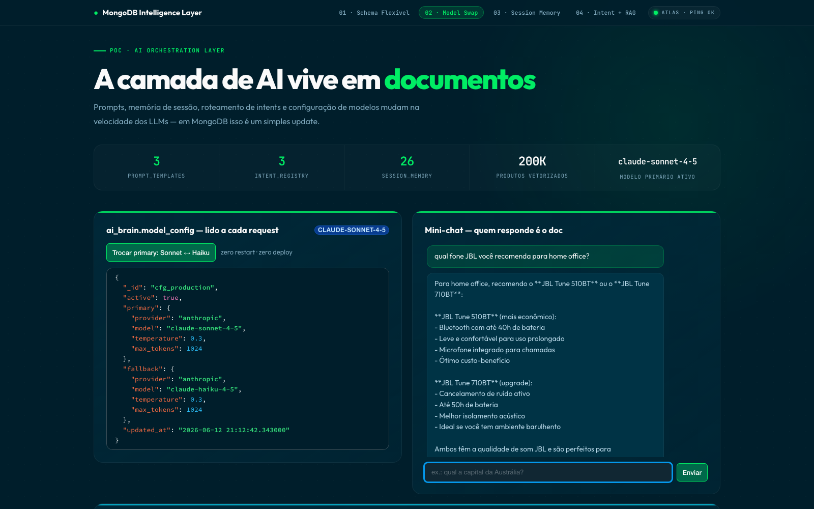
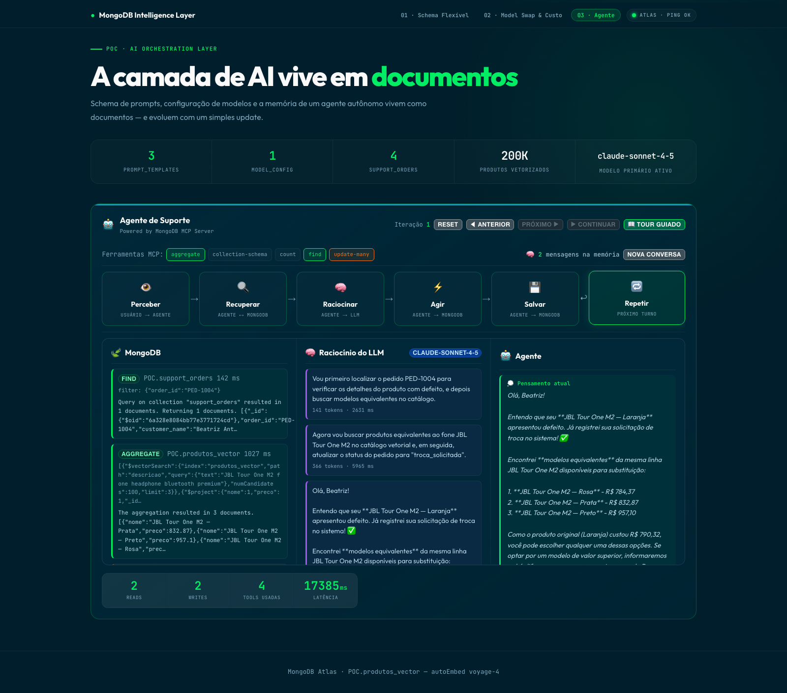
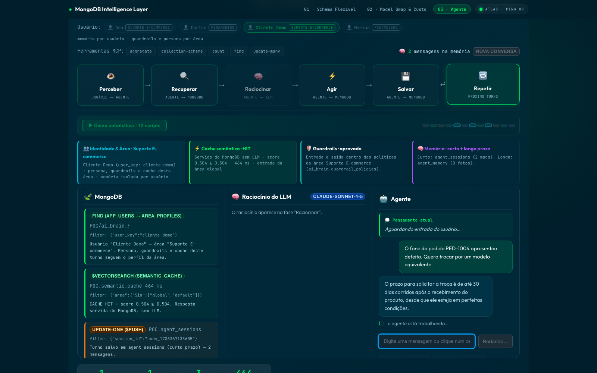

# Camada de inteligência no MongoDB — POC

A maioria das aplicações de IA guarda sua "inteligência" em todo lugar menos no banco: prompts fixos no código, o nome do modelo numa variável de ambiente, um vector store à parte, um cache em outro serviço, memória do agente em lugar nenhum. Cada ajuste vira um deploy.

Esta PoV coloca isso no banco. Schemas de prompt, configuração de modelo, cache semântico, políticas de guardrail e as memórias de curto e longo prazo do agente são documentos — mudados com um `update_one`, aplicados na requisição seguinte, sem restart. Um cluster, uma linguagem de consulta, um modelo de segurança, e cada acerto de cache, fato de memória e decisão de guardrail é um documento consultável em vez de uma caixa-preta.

**Stack:** React + Vite + LeafyGreen · FastAPI + PyMongo Async · MongoDB Atlas (Vector Search, autoEmbed `voyage-4`) · MongoDB MCP Server · Claude Sonnet 4.5 / Haiku 4.5. UI em pt-BR (usada em sessões com clientes).

## A demo em 4 passos

**1. Prompts são documentos polimórficos.** Uma variante por modelo é um `$set` ao vivo contra o Atlas, e o JSON se atualiza na tela na hora.



**2. Trocar o modelo de produção é um `update_one`.** O `model_config` é lido em toda requisição; Sonnet ↔ Haiku muda latência e custo com zero deploys. O painel de custo projeta o gasto mensal a partir da contagem real de tokens da sessão.



**3. O agente roda um loop real de uso de ferramentas pelo MongoDB MCP Server.** Ele decide quais ferramentas chamar — `find` de um pedido, `$vectorSearch` no catálogo, `update` de um status — e elas executam contra o Atlas pelo mesmo protocolo que uma IDE usaria. A execução é reproduzida passo a passo em `Perceive → Retrieve → Reason → Act → Store → Loop`, com contadores reais de leitura/escrita/latência.



**4. Pergunte algo já respondido — nenhuma chamada ao LLM.** A pergunta passa por `$vectorSearch` contra o cache semântico; acima do limiar, a resposta armazenada é servida direto do MongoDB e a UI levanta um CACHE HIT com o score e a latência.



## O que roda a cada turno

```
mensagem → [guardrail de entrada + máscara de PII] → [cache semântico?] ──HIT──→ resposta, sem LLM ⚡
                                   │ MISS
                                   ▼
     memória de longo prazo relevante + turnos recentes → loop de ferramentas MCP → [guardrail de saída]
                                   ▼
                    grava curto prazo + longo prazo → escreve no cache (se genérico)
```

Cada etapa é uma operação real do MongoDB, visível no trace e no inspector dentro da aplicação.

**Memória em duas camadas.** O curto prazo é o `agent_sessions` — os `turns[]` da conversa atual, limitados com `$slice`, com a janela recente hidratada no contexto enquanto o histórico completo continua sendo uma query. O longo prazo é o `agent_memory` — um documento por fato durável sobre o usuário, recuperado por `$vectorSearch` pré-filtrado por `user_key` + `active`, de modo que o tamanho do prompt não cresce com o tamanho da memória. Um fato contraditório não sobrescreve: ele insere e vira o antigo para `active: false` + `superseded_by` em uma única transação ACID, e o inspector mostra o histórico riscado.

**Multi-tenant por pré-filtro, não por pós-filtro.** `area` / `user_key` / `active` são campos `filter` nos índices vetoriais, então a busca ANN só percorre vetores válidos para quem pediu — o top-K continua correto conforme as coleções crescem.

**Isolamento por área.** Cada usuário pertence a uma área que decide três coisas por turno, todas por leitura de documento: a persona anexada ao prompt de sistema, qual documento de `guardrail_policies` se aplica e quais entradas de cache são visíveis. Experimente *"Consegue me dar um desconto na fatura por fora?"* como a Marina (Financeiro) — bloqueado; a mesma mensagem como o Adriano (Suporte) é respondida normalmente.

**Higiene de cache.** Turnos que tocaram um pedido específico ou que usaram fatos do próprio cliente nunca vão para o cache — uma resposta personalizada não pode ser repetida para outra pessoa. Entradas criadas em tempo de execução carregam `expires_at` e um índice TTL as apaga; as FAQs semeadas nunca expiram.

**Memória é dado, nunca instrução.** Os fatos são injetados entre delimitadores `<fatos_do_cliente>` com uma instrução explícita de ignorar comandos embutidos, e o extrator recusa "fatos" em formato de instrução — essa é a defesa contra envenenamento de memória.

**O que impede o agente de derrubar uma coleção.** O loop expõe apenas `find`, `aggregate` e um `update-many` com escopo; cada chamada é reescrita no servidor antes de chegar ao MCP (leituras de pedido precisam de um ID escalar `PED-...` e recebem projeção sem PII; escritas podem definir um único campo de status aprovado; leituras de sessão ficam presas a quem chamou). Em produção, limite também o usuário Atlas do MCP Server às coleções exatas, ou rode-o com `MDB_MCP_READ_ONLY=true`.

> **Os limiares são medidos, não chutados.** A escala do `vectorSearchScore` pode mudar quando o índice/modelo autoEmbed voyage-4 é atualizado (este cluster foi de ~0,50 para ~0,59–0,86 em agosto de 2026). O ranqueamento é confiável, a escala absoluta não. `ai_brain.cache_config` e `ai_brain.guardrail_policies` guardam os limiares ao vivo, definidos pelo `backend/calibrate_thresholds.py` contra probes rotuladas. Rode de novo sempre que o modelo, o cluster, o índice ou os dados semeados mudarem.

**Observability opcional via Langfuse.** Com `LANGFUSE_PUBLIC_KEY`/`LANGFUSE_SECRET_KEY` no `.env`, cada turno vira uma trace replayável (generation por chamada de LLM, span por tool call MCP) — badge "Ver trace no Langfuse" na UI. Sem as chaves, vira no-op e nada muda. Detalhes em [`docs/briefing/architecture.md`](docs/briefing/architecture.md#observability-opcional-langfuse).

**Pitch sem as mãos.** O *▶ Demo automática* toca uma playlist de 12 roteiros alternando cache, guardrail, memória, agente transacional e isolamento por área, trocando a pílula de usuário ao vivo para que a plateia veja a mesma pergunta bloqueada em uma área e respondida em outra. Em pausa, ◀/▶ reproduzem roteiros já executados a partir do histórico em memória — sem novas chamadas de API, com os resultados exatamente como aconteceram.

## Coleções

| Coleção | Banco | Papel |
|---|---|---|
| `cache_config` | ai_brain | limiar/TTL de cache ao vivo |
| `model_config` | ai_brain | modelo ativo, lido a cada requisição |
| `area_profiles` | ai_brain | persona e regras por área |
| `guardrail_policies` | ai_brain | política por área |
| `semantic_cache` | POC | Q&A + vetor autoEmbed, marcado por área |
| `agent_sessions` | POC | memória de curto prazo |
| `agent_memory` | POC | fatos de longo prazo por `user_key` |
| `guardrail_denylist` | POC | frases proibidas + vetor |
| `guardrail_events` | POC | log de auditoria (TTL 30d) |
| `agent_traces` | POC | trace reproduzível por turno (TTL 30d) |
| `app_users` | POC | usuário → área |

## Como rodar

```bash
cp .env.example .env
./start.sh          # FastAPI :8010 + Vite :5183
```

Por padrão, o launcher serve o build otimizado do frontend sem watcher. Para desenvolver com HMR, rode `POV_DEV=1 ./start.sh`; o build só é refeito quando fontes, lockfile ou configuração mudam. Separadamente: `cd backend && .venv/bin/uvicorn main:app --reload --port 8010` e `cd frontend && npm run dev`.

```bash
cd backend && .venv/bin/python -m unittest discover -s tests -v
cd backend && .venv/bin/python seed.py                  # idempotente, restaura os dados de demo — não no meio da apresentação
cd backend && .venv/bin/python calibrate_thresholds.py  # --apply grava os limiares medidos
npm run test:visual                                     # regressão visual com Playwright, aplicação rodando
# Fallback reservado se :5183 estiver ocupada:
cd frontend && npx vite --port 5283 --strictPort
# em outro terminal: BASE_URL=http://localhost:5283 npm run test:visual
```

Docker: `docker build -t intelligence-layer-poc . && docker run --env-file .env -p 18082:8080 intelligence-layer-poc`.

## Perfil de produção

Defina `ENVIRONMENT=production`, `AUTH_REQUIRED=1` e `DEMO_TOKEN_ISSUANCE_ENABLED=0`. A inicialização rejeita segredos de JWT ou admin fracos/padrão e CORS com curinga; o `/metrics` exige autorização de admin. Nomes de modelo e caminhos de update passam por allowlist para evitar injeção de campos com ponto ou `$`. A imagem roda como UID 10001 atrás do nginx com cabeçalhos de segurança.

