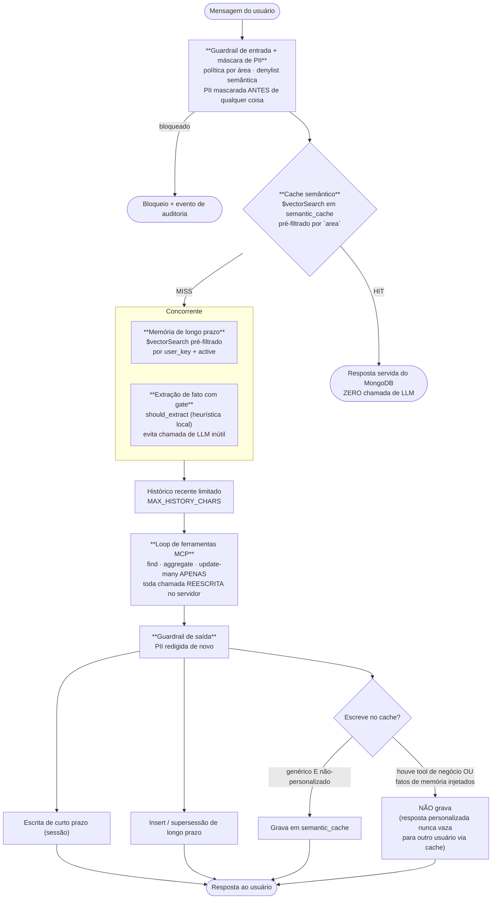
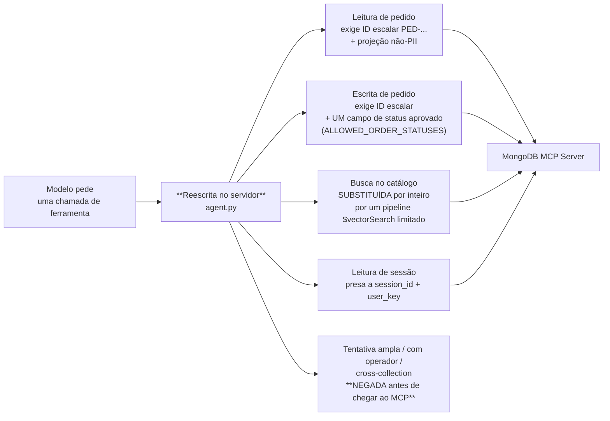
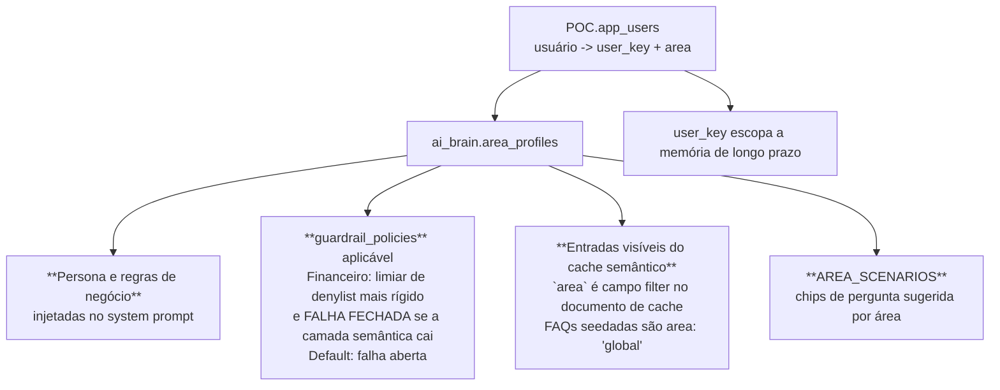

# Intelligence Layer — MongoDB Atlas como Camada de Dados *e* de Orquestração de um Agente

PoV de demonstração para cliente mostrando o Atlas como camada de dados **e** de orquestração de um agente de IA: **configuração de prompt, configuração de modelo, cache semântico e memória do agente vivem todos como documentos MongoDB** — não como config de aplicação nem em um vector DB separado.

Este é também o material de contraponto ao Postgres: a comparação não é sobre o Postgres não conseguir, é sobre quantos componentes você precisa operar para chegar no mesmo lugar, e quanto do comportamento do agente fica inspecionável depois.

A UI de demo (LeafyGreen/React) é em português, usada ao vivo com times de clientes brasileiros.

`README.md` tem o pitch completo; `docs/implementation-handoff.md` tem os invariantes obrigatórios e as fronteiras conhecidas — os dois são mantidos atualizados e têm mais autoridade que redescobrir o comportamento lendo o código.

---

## 1. As três abas

Um backend, um cluster Atlas, dois databases: `ai_brain` (configuração viva) e `POC` (dados de demo).

| Aba | O que mostra | A jogada |
|---|---|---|
| **1 — Schema flexível** | Templates de prompt como documentos polimórficos | Adicionar uma variante de modelo é um `$set` ao vivo |
| **2 — Troca de modelo e custo** | `ai_brain.model_config` é lido **a cada chamada de LLM** (`backend/llm.py`) | Trocar Sonnet ↔ Haiku é um `update_one`. Zero deploy |
| **3 — Agente** | Agente autônomo de suporte (`backend/agent.py`) rodando um loop de tool use real contra o MongoDB **através do MongoDB MCP Server** | Não é simulação: mesmo protocolo que uma IDE usaria |

Na aba 3, uma tarefa supervisora de background é dona da sessão MCP sobre stdio, faz ping a cada 30s e reconecta com backoff.

---

## 2. O pipeline por turno

```
guardrail de entrada + máscara de PII → busca no cache semântico (escopado por área)
  → HIT: servido do MongoDB, sem chamada de LLM
  → MISS: consulta de memória de longo prazo relevante + extração de fato com gate (concorrentes)
         → histórico recente limitado → loop de ferramentas MCP → guardrail de saída
         → escrita de curto prazo → insert/supersessão de longo prazo
         → escrita no cache (só se genérico e não-personalizado)
```



---

## 3. Frontend

Este PoV é material de battlecard: a conversa é "Atlas como camada de inteligência vs. Postgres + N peças coladas". O argumento só fecha se a tela mostrar **configuração mudando ao vivo**, sem redeploy. Toda a estratégia do frontend sai daí.

Regra que vale pra tudo: **nada de valor decidido no cliente.** Área, política, modelo, escopo de cache — tudo vem do backend, derivado do token. O React exibe.

### 3.1 Stack

React 18 + Vite + LeafyGreen, JavaScript sem TypeScript. Sem router, sem biblioteca de estado, sem cliente HTTP externo — `fetch` cru embrulhado em `request()` no `api.js`.

`@leafygreen-ui/code` é a dependência que mais importa aqui: ela renderiza os documentos MongoDB e os pipelines com destaque de sintaxe. Metade do argumento do PoV é "olha o documento antes e depois".

`nodePolyfills` é obrigatório porque `@emotion/server`, dependência transitiva do LeafyGreen, usa builtins do Node.

### 3.2 Estado que sobrevive à troca de aba

Detalhe de arquitetura pequeno com efeito grande na demo: o estado das três abas vive no `App.jsx` e desce por props (`schemaState`, `modelSwapState`, `agentState`). As abas não são donas do próprio estado.

O motivo é prático: durante a apresentação eu volto e avanço entre abas o tempo todo — mostro o schema, troco o modelo, rodo o agente, volto pro schema. Se cada aba desmontasse e perdesse o que fez, cada retorno começaria do zero e a narrativa quebraria. Com o estado no shell, o trace do agente continua lá quando eu volto.

### 3.3 As três abas

| Aba | Componente | O que precisa ficar visível |
|---|---|---|
| **Schema flexível** | `FlexibleSchema.jsx` | O documento **antes e depois** do `$set`. A variante nova aparece sem migração, sem downtime, sem ALTER TABLE |
| **Troca de modelo e custo** | `ModelSwap.jsx` | Um `update_one` trocando Sonnet ↔ Haiku, e a próxima resposta já vindo do outro modelo. Zero deploy |
| **Agente** | `Agent.jsx` | O loop de tool use real contra o MongoDB via MCP Server, com cada chamada e cada reescrita de política à vista |

`Agent.jsx` tem 890 linhas e é, com folga, a maior tela do projeto. Faz sentido: ela precisa mostrar o turno inteiro — guardrail, máscara de PII, cache, memória, chamadas de ferramenta, reescrita de política e trace. Cada uma dessas etapas é um argumento separado na conversa com o cliente.

O flash visual na aba 1 (`flash` no `schemaState`) existe só pra marcar o instante em que o documento mudou. Sem ele, o `$set` ao vivo passa despercebido em projetor.

### 3.4 Componentes de apoio

- **`JsonViewer`** — documento cru, formatado. É o que sustenta "polimórfico" como afirmação verificável.
- **`PipelineSteps`** — as etapas do turno em ordem. Transforma o parágrafo da seção 2 em imagem.

### 3.5 Contrato com o backend

`api.js` agrupa os endpoints por aba, e mantém o token JWT em memória de módulo. **O switcher de identidade é o login da demo**: escolher um usuário chama `POST /api/auth/token`, e daí em diante toda requisição carrega esse token.

Isso não é detalhe cosmético. A área do usuário sai da claim `sub` do token, **nunca do payload da requisição**. É o que garante que o isolamento de cache e de política por área (seção 6) seja real, e não um filtro que o cliente poderia mudar no DevTools.

| Grupo | Funções | Endpoints |
|---|---|---|
| Sessão | `login`, `users`, `health`, `metrics` | `/api/auth/token`, `/api/users`, `/api/health`, `/api/metrics` |
| Aba 1 | `listTemplates`, `getTemplate`, `addVariant`, `removeVariant` | `/api/templates/…` |
| Aba 2 | `getModelConfig`, `swapModels`, `quickChat` | `/api/model-config`, `/api/model-config/swap`, `/api/chat/quick` |
| Aba 3 | `agentScenarios`, `agentPlaylist`, `agentTools`, `agentRun` | `/api/agent/…` |
| Inspeção | `cacheInspect`/`cacheClear`, `memoryInspect`/`memoryShort`/`memoryClear`, `guardrailsPolicy`/`guardrailsRules`/`guardrailsEvents` | `/api/cache`, `/api/memory/…`, `/api/guardrails/…` |

Os endpoints de inspeção existem para a demo. `agentScenarios` traz os chips de cenário já filtrados pela área do usuário, e `agentPlaylist` é a sequência ensaiada — ninguém digita pergunta ao vivo.

Os botões de limpar cache e memória são o que permite **repetir a mesma demo do zero** na frente do próximo cliente. Sem eles, o segundo turno bate no cache e o efeito some.

### 3.6 O que a tela precisa provar

- **Documento mudando ao vivo** na aba 1 — schema flexível deixa de ser slide.
- **Modelo trocando por `update_one`** na aba 2, com a resposta seguinte já vindo do novo.
- **Cache batendo (e sendo limpo)** — com o escopo de área visível.
- **Fato de longo prazo sendo recuperado** da memória, com o `user_key` que o filtrou.
- **Guardrail mascarando PII e bloqueando**, com o evento de auditoria correspondente.
- **Cada chamada de ferramenta do agente** e a versão reescrita no servidor, lado a lado. É a prova de que a allowlist não é decorativa.

### 3.7 Build

```bash
cd frontend && npm install && npm run dev   # :5183, proxia /api -> :8010
cd frontend && npm run build
```

A porta do backend no proxy sai de `BACKEND_PORT`, com default 8010. Não há script de lint nem de teste no frontend.

---

## 4. Ordem de leitura do código

Para entender uma mudança, ler nesta ordem:

1. `backend/agent.py` — orquestração, allowlist e reescrita de política de ferramentas, budgets de contexto, métricas, o catálogo de chips `AREA_SCENARIOS` e a `DEMO_PLAYLIST`.
2. `backend/memory.py` — recuperação de fato de longo prazo (`$vectorSearch` pré-filtrado por `user_key` + `active`), o gate local de extração (`should_extract`), extração, dedup e supersessão.
3. `backend/cache.py` — busca/gravação no cache semântico escopado por área, TTL, fallback de casamento exato.
4. `backend/guardrails.py` — busca de política por área, mascaramento de PII na entrada, denylist semântica, eventos de auditoria.
5. `backend/profiles.py` — resolução usuário → área (`app_users`, `area_profiles`).
6. `backend/main.py` — superfície de API, posse do session ID, persistência de trace.
7. `backend/tests/test_policies.py` — especificação executável da reescrita de política de ferramentas e do isolamento de cache.

---

## 5. Invariantes obrigatórios

Não relaxar nenhum destes sem atualizar `docs/implementation-handoff.md`.

### Superfície de ferramentas é `find`, `aggregate`, `update-many`. Só.

Nenhum delete, drop, count ou enumeração de schema chega ao modelo. Nunca.

### Toda chamada de ferramenta é **reescrita** no servidor antes de chegar ao MCP — não só validada



A diferença entre validar e reescrever importa: validar deixa o modelo definir a forma da query e só checa se é aceitável. Reescrever significa que **a forma da query é do servidor**, e o modelo só contribui os parâmetros que sobrevivem à reescrita.

### Higiene de cache

Nada de gravar no cache depois de uma chamada de ferramenta de negócio, e nada de gravar quando fatos de memória de longo prazo foram injetados no prompt. **Resposta personalizada não pode vazar para outro usuário através do cache compartilhado.**

### Memória é dado, nunca instrução

Fatos recuperados são injetados dentro de delimitadores `<fatos_do_cliente>` com uma instrução explícita de ignorar comandos embutidos, e o extrator **recusa "fatos" com forma de instrução**.

Essa é a defesa contra envenenamento de memória. Não remover o enquadramento por delimitador ao mexer na montagem de prompt.

### Isolamento multi-tenant é pré-filtro nativo, não pós-filtro na aplicação

`area`, `user_key` e `active` são campos do tipo `filter` nas definições dos índices vetoriais (`semantic_cache_vs`, `guardrail_denylist_vs`, `agent_memory_vs`). Então o `$vectorSearch` **só percorre vetores válidos para quem pediu** — não busca tudo e descarta depois.

Ao adicionar uma nova busca vetorial por tenant, a chave do tenant tem que ser campo `filter` na definição do índice, não um `.filter()` em Python depois.

### PII é mascarada antes de chegar ao LLM, ao cache, ao extrator de memória ou ao trace

E redigida de novo na saída, antes de chegar ao usuário. Leituras de ferramenta projetam campos de identidade para fora (`ORDER_FIELDS_FOR_AGENT` em `agent.py`).

### Budgets de caractere são determinísticos, não precisos em token

`MAX_HISTORY_CHARS`, `MAX_PROMPT_MEMORY_CHARS`, `MAX_TOOL_RESULT_CHARS`, `MAX_USER_MESSAGE_CHARS` em `agent.py`/`memory.py` são **travas de segurança, não estimativa de billing**. A contagem real de token vem do usage do provedor, no trace.

### Identidade vem do seletor da UI **só nesta demo**

`POC.app_users` é a fronteira de identidade registrada (`profiles.require_demo_user`). Em produção, `user_key` e área têm que sair de claims de JWT/OIDC, nunca do payload. `AUTH_REQUIRED=1` liga enforcement real de Bearer token; desligado por padrão para a demo.

---

## 6. Isolamento por área



Cada usuário tem um `user_key` (escopa memória) e uma área/departamento. A área decide três coisas por turno, todas por leitura de documento — nenhuma por código.

O detalhe do Financeiro merece atenção em demo: ele **falha fechado** se a camada semântica cair. Área com risco maior não degrada para permissivo.

---

## 7. Scores são medidos, nunca hardcoded

O autoEmbed voyage-4 neste cluster comprime o `vectorSearchScore` numa banda estreita: **~0.5014 para não-relacionado, ~0.5056 para idêntico**. Texto idêntico **não** dá 1.0 aqui.

Consequência prática: **o ranqueamento é confiável; a escala absoluta não é.**

Por isso os limiares de cache e de guardrail vivem em `ai_brain.cache_config` / `guardrail_policies` e são definidos por `backend/calibrate_thresholds.py` contra pares de sonda rotulados. Rodar de novo depois de trocar o modelo de embedding, o tier do Atlas ou os dados de seed. **Nunca escolher limiar na mão.**

---

## 8. Como rodar

### Backend (`backend/`, Python 3.12+, venv em `backend/.venv`)
```bash
cd backend
.venv/bin/python -m unittest discover -s tests -v      # todos os testes
.venv/bin/python -m unittest tests.test_policies -v    # módulo único
.venv/bin/python -m compileall -q .                    # checagem de sintaxe
.venv/bin/python seed.py                               # repopula ai_brain + POC — ver aviso abaixo
.venv/bin/python calibrate_thresholds.py               # remede as bandas de score (--apply grava)
.venv/bin/python tests/smoke.py [BASE_URL]             # smoke pós-deploy (default http://127.0.0.1:8010)
.venv/bin/uvicorn main:app --reload --port 8010
```

### Frontend (`frontend/`, Node 20+)
```bash
cd frontend && npm install && npm run dev   # http://localhost:5183
```

### Os dois de uma vez
```bash
./start.sh   # FastAPI :8010, Vite :5183; pula o start do backend se a 8010 já estiver ocupada
```

### Regressão visual (da raiz, app rodando)
```bash
npm install
npm run test:visual            # Playwright, compara as abas contra as baselines em tests/visual/
npm run test:visual:update     # regenera baselines após mudança intencional de UI
```

Aponta para `http://localhost:5183` por padrão. **Se essa porta estiver tomada por outra coisa, os screenshots batem na página errada e o diff não significa nada.** Nesse caso: `npx vite --port 5174` e `BASE_URL=http://localhost:5174 npm run test:visual`.

### Docker
```bash
docker build -t intelligence-layer-poc .
docker run --env-file .env -p 8080:8080 intelligence-layer-poc   # nginx serve o build e proxia /api para o FastAPI
```

### Aviso sobre `seed.py`

É idempotente (seguro rodar de novo), **mas reseta os dados de demo** — pedidos, FAQs do cache, perfis de área, políticas e denylist de guardrail voltam ao estado de seed. **Não rodar durante apresentação ao vivo.** Rodar de propósito, antes, num reset controlado.

---

## 9. Roteiro de demonstração

1. **Aba 1** — mostrar dois templates de prompt com formatos diferentes convivendo na mesma coleção. Adicionar uma variante ao vivo com `$set`.
2. **Aba 2** — fazer uma pergunta, mostrar o custo. Trocar o modelo em `ai_brain.model_config` com um `update_one`, refazer a pergunta. Custo muda, deploy nenhum aconteceu.
3. **Aba 3, primeira pergunta** — deixar o agente rodar o loop MCP. Mostrar no trace as queries reais que ele executou.
4. **Repetir a mesma pergunta** — cache hit, **zero chamada de LLM**, servido do MongoDB.
5. **Fazer uma pergunta personalizada** (que puxa memória de longo prazo). Mostrar que essa **não** entrou no cache — e explicar por quê.
6. **Trocar de identidade no seletor.** A mesma pergunta não recupera a memória do usuário anterior: o pré-filtro por `user_key` está na definição do índice.
7. **Tentar induzir o agente a uma query ampla.** Mostrar a negação acontecendo **antes** do MCP, no reescritor.
8. **Trocar para a área Financeiro.** Mostrar o limiar mais rígido e o comportamento de falha fechada.

---

## 10. Fronteiras conhecidas do PoV

Lista completa em `docs/implementation-handoff.md`. As principais:

- Pedidos de demo não são escopados por tenant além do `owner_user_key` seedado.
- Endpoints de reset são conveniências de demo, sem autenticação.
- O gate de extração (`memory._DURABLE_SIGNAL_RE`) é uma heurística de regex do domínio em português, **não um classificador**.

São tradeoffs documentados, não descuidos. Não "consertar" isoladamente sem checar se o conserto está no escopo da tarefa atual.

---

## 11. Caminho para produção

| Item | No PoV | Em produção |
|---|---|---|
| Identidade | Seletor da UI + `POC.app_users` | Claims de JWT/OIDC; `AUTH_REQUIRED=1` sempre |
| Escopo de tenant | `owner_user_key` seedado | Escopo real em toda coleção, com o mesmo padrão de campo `filter` no índice vetorial |
| Gate de extração | Regex de domínio em português | Classificador leve, avaliado contra dados rotulados |
| Limiares | Calibrados contra sondas seedadas | Recalibração periódica contra tráfego real rotulado |
| Endpoints de reset | Abertos | Removidos ou atrás de RBAC administrativo |
| Deploy | Container único (nginx + FastAPI) | Mesma imagem, com segredos em cofre gerenciado e observabilidade exportada |
